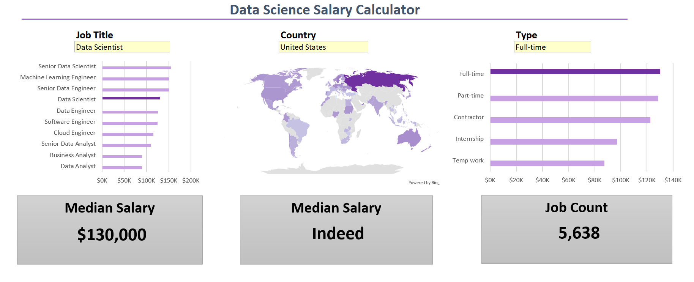

# 🧮 Data Science Salary Calculator Dashboard
## 📊 Overview

An **interactive Excel dashboard** that visualizes and analyzes data science salaries by job title, employment type, and country.
It includes key **KPI indicators** displaying **median salaries and job count**, along with dynamic filters, bar charts, and a global salary map.

  

